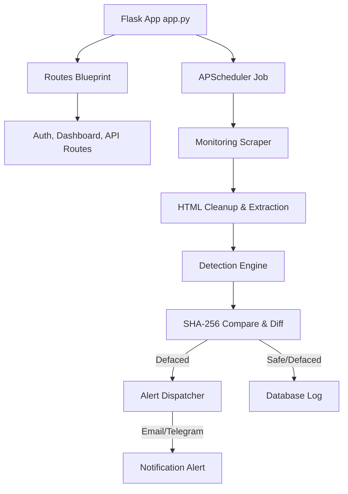

# Documentation - Website Defacement Monitoring System

This document outlines the architecture, setup guide, and verification steps for the Website Defacement Monitoring System (Sentinel Guard).

---

## 1. System Architecture

The application is built on a modular Python/Flask model:



### Main Components
- **Scraper Service (`services/scraper.py`)**: Uses Python `requests` with custom HTTP headers to fetch source code. Cleans dynamic tokens/time labels. Integrates headless Chrome via `selenium` to capture page screenshot.
- **Detection Service (`services/detection.py`)**: Generates SHA-256 hashes, performs line-by-line unified diffs using `difflib`, and assesses incident severity levels (Low, Medium, High, Critical).
- **Alert Service (`services/alerts.py`)**: Handles SMTP email compilation and Telegram Bot API message posting. Supports sandbox testing by default.
- **PDF Generator Service (`services/pdf_generator.py`)**: Generates and compiles audit documents containing scan details and code diff highlights using `reportlab`.

---

## 2. Installation Guide

### Prerequisites
- **Python**: Python 3.8 or higher.
- **Google Chrome** (Optional): Required if full page screenshot captures are wanted (runs headlessly).

### Step-by-Step Setup

1. **Clone or Navigate to the Directory**:
   Ensure you are in the project folder `website-defacement-monitoring/`.

2. **Create a Virtual Environment**:
   If not using `uv`, create and activate a standard virtual environment:
   ```bash
   python -m venv .venv
   # Windows:
   .venv\Scripts\activate
   # Linux/macOS:
   source .venv/bin/activate
   ```

3. **Install Dependencies**:
   ```bash
   pip install -r requirements.txt
   ```

4. **Run Database Initialization**:
   Flask will automatically create the SQLite database file `defacement_monitor.db` in the workspace when the server starts.

5. **Start Flask Server**:
   ```bash
   python app.py
   ```
   The application will be accessible at: [http://localhost:5000](http://localhost:5000).

---

## 3. Configuration Management

Configurations are managed in [config.py](file:///c:/Users/kinga/OneDrive/Pictures/Desktop/website%20defacmenet/config.py):

- **Database**: Defaults to local SQLite (`defacement_monitor.db`).
- **Interval**: Set `SCAN_INTERVAL_MINUTES` (default is 5 minutes).
- **Alert Sandbox**: `ALERT_SANDBOX = True` writes alerts to system logs instead of sending live emails. Set to `False` for production alerts.
- **SMTP**: Configure SMTP variables (`SMTP_SERVER`, `SMTP_PORT`, `SMTP_USER`, `SMTP_PASSWORD`) for email dispatch.
- **Telegram**: Configure `TELEGRAM_BOT_TOKEN` and `TELEGRAM_CHAT_ID` for Telegram alerts.

---

## 4. API Endpoints Reference

| Endpoint | Method | Role | Description |
| :--- | :--- | :--- | :--- |
| `/api/websites` | `GET` | User / Admin | Retrieve registered websites list |
| `/api/websites` | `POST` | User / Admin | Register a new website and establish its baseline hash |
| `/api/websites/<id>` | `DELETE` | Owner / Admin | Delete website record and all related scan logs |
| `/api/websites/<id>/toggle` | `POST` | Owner / Admin | Enable or pause background scanning for the website |
| `/api/websites/<id>/scan` | `POST` | Owner / Admin | Instantly trigger a manual integrity check scan |
| `/api/websites/<id>/baseline` | `POST` | Admin | Approve the latest scan state as the new baseline |

---

## 5. Testing & Verification Procedures

### Integration Script Verification
We have included a mock simulation script `verify_setup.py` that validates all backend operations without launching the web server.

Run the verification:
```bash
python verify_setup.py
```
Upon successful execution, this script will:
- Initialize a temporary test DB `test_verification.db`.
- Seed a dummy admin account.
- Scrape mock HTML pages (safe and defaced states).
- Verify the SHA-256 detection engine correctly flags script injections and severity levels.
- Compile a PDF report using ReportLab: `test_defacement_report.pdf`.

### Manual End-to-End Verification
To test the web panel:
1. Start the Flask application: `python app.py`
2. Open your web browser to `http://localhost:5000` and register an account (the first account automatically receives the `admin` role).
3. Set up a simple local HTML file or use an active website you own. Let's say you register a local site pointing to a test file.
4. Click **Add Website**, input the name, URL, and select a monitoring interval.
5. Once registered, the site list should display the site status as **Safe**.
6. Modify the target page HTML (e.g. edit the text, add a `<script>` script injection, or change the title to include keywords like "hacked").
7. Return to the dashboard and click **Scan**.
8. The site status badge will instantly toggle to **DEFACED** with the calculated severity level.
9. Click **View** to inspect the line-by-line colored code differences and compare screenshots.
10. Click **Export PDF Report** to download the security assessment log.
11. If the modifications are authorized (e.g. you updated the design), click **Approve as New Baseline** to update the reference hash.
